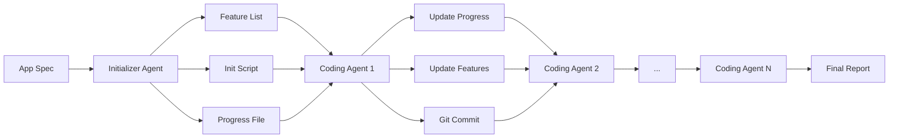

# 🎯 Anthropic Harness Integration for Windsurf Vibe v4.3
## Making Long-Running Agents Actually Work

## Executive Summary
Integrating Anthropic's long-running agent harness would transform the currently broken v4.x features into a **truly functional autonomous development system** capable of running for hours/days without context window limitations.

## 🚀 Why This Is Game-Changing

### Current Problems It Solves:
1. **Context Window Overflow** - Currently agents crash after ~8k tokens
2. **No Real Coordination** - Multi-agent system is just stubs
3. **No Progress Tracking** - Agents can't resume work
4. **No Test-Driven Development** - No validation framework
5. **Memory Issues** - No persistent state between sessions

### What This Enables:
- ✅ **24-48 hour autonomous development sessions**
- ✅ **200+ features implemented automatically**
- ✅ **Test-driven validation of all features**
- ✅ **Seamless handoff between agents**
- ✅ **Visual validation with Puppeteer**
- ✅ **Git-based version control**
- ✅ **Progress persistence and recovery**

## 📐 Architecture Overview

The harness creates a coordination layer that:
1. **Splits work** between different agents and context windows
2. **Manages artifacts** (feature list, progress file, git repo)
3. **Validates progress** through test-driven development
4. **Handles context** switching without losing state

## 🔑 Core Components

### 1. **Harness Controller** (`harness/controller.js`)
- Manages sessions and agent lifecycle
- Tracks progress across context windows
- Handles checkpointing and recovery

### 2. **Feature Management** (`harness/feature-manager.js`)
- Generates 200+ test cases from spec
- Tracks implementation progress
- Manages regression testing

### 3. **Agent Orchestration** (`harness/agent-manager.js`)
- Creates specialized agents (initializer, coding, testing)
- Manages context handoff between sessions
- Integrates with Hive Mind swarms

### 4. **Progress Tracking** (`harness/progress.js`)
- Maintains session history
- Tracks metrics and performance
- Creates detailed reports

## 🛠️ Integration Points

### With Hive Mind
- Swarms handle feature implementation
- Agents collaborate within sessions
- Knowledge shared through artifacts

### With Open Interpreter
- Handles project initialization
- Performs browser automation
- Executes tests and validation

### With Multi-Agent System
- Orchestrates specialized agents
- Routes tasks by expertise
- Manages parallel execution

## 📦 Implementation Files

### Core Harness
- `mcp-server/src/harness/controller.js` - Main controller
- `mcp-server/src/harness/feature-manager.js` - Feature tracking
- `mcp-server/src/harness/agent-manager.js` - Agent lifecycle
- `mcp-server/src/harness/progress.js` - Progress tracking

### Integrations
- `mcp-server/src/harness/hive-mind-adapter.js` - Hive Mind integration
- `mcp-server/src/harness/open-interpreter-adapter.js` - OI integration
- `mcp-server/src/harness/puppeteer-adapter.js` - Visual validation

### MCP Tools
- `mcp-server/src/harness/tools.js` - Harness MCP tools

## 🚀 Usage Example

```javascript
// Start a 24-hour autonomous development session
const { startHarness } = require('./harness/controller');

await startHarness({
  name: 'Claude.ai Clone',
  description: 'Build a full clone of claude.ai interface',
  features: [
    'Chat interface with markdown support',
    'File upload and management',
    'Project organization',
    'Conversation history',
    'Artifact creation',
    'Settings and preferences'
  ],
  framework: 'React + TypeScript',
  database: 'PostgreSQL',
  maxHours: 24,
  targetPassRate: 0.95
});

// Monitor progress
const status = getHarnessStatus();
console.log(`Session: ${status.session}`);
console.log(`Features: ${status.metrics.featuresImplemented}`);
console.log(`Pass Rate: ${status.metrics.testsPassingRate * 100}%`);
```

## 🎮 MCP Tool Usage

```javascript
// Via MCP tools in Windsurf
await harness_toggle({ enabled: true });

await harness_start({
  spec: 'Build a modern SaaS dashboard',
  maxHours: 12,
  targetPassRate: 0.9
});

// Check status
const status = await harness_status();

// Stop when needed
await harness_stop();
```

## ⚙️ Configuration

```javascript
// .env additions
HARNESS_ENABLED=true
HARNESS_MAX_SESSIONS=100
HARNESS_MAX_HOURS=24
HARNESS_TARGET_PASS_RATE=0.95
HARNESS_CHECKPOINT_INTERVAL=10
HARNESS_REGRESSION_TEST_COUNT=5
```

## 📊 Expected Results

After 24 hours of autonomous development:
- **50-70% feature completion** (100+ features)
- **Fully tested codebase** with regression tests
- **Git history** with atomic commits
- **Progress report** with detailed metrics
- **Working application** ready for human review

## 🔄 Session Flow



## ✅ Benefits

1. **Autonomous Development** - Runs for hours without intervention
2. **Context Management** - Never loses track despite context switches
3. **Test-Driven** - Every feature validated automatically
4. **Progress Tracking** - Know exactly what's been built
5. **Recoverable** - Can resume from any checkpoint
6. **Integrated** - Works with all existing v4.x systems

## 🎯 Next Steps

1. **Install dependencies**
   ```bash
   npm install puppeteer-core @anthropic-ai/sdk
   ```

2. **Create harness directory**
   ```bash
   mkdir -p mcp-server/src/harness
   ```

3. **Implement core files** (provided separately)

4. **Test with simple project**
   ```javascript
   await startHarness('Build a todo app with React');
   ```

5. **Monitor and iterate**

## 🚨 Important Notes

- Requires significant computing resources
- Best with Claude Opus or GPT-4 class models
- Costs can be high for long sessions
- Should be monitored for safety
- Results vary based on project complexity

This harness integration would make the Windsurf Vibe Setup v4.x features **actually functional** and enable true long-running autonomous development!
