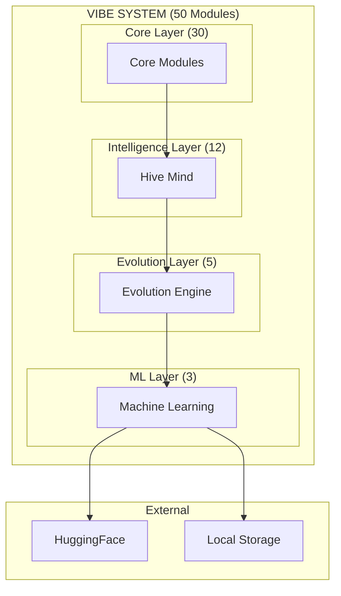
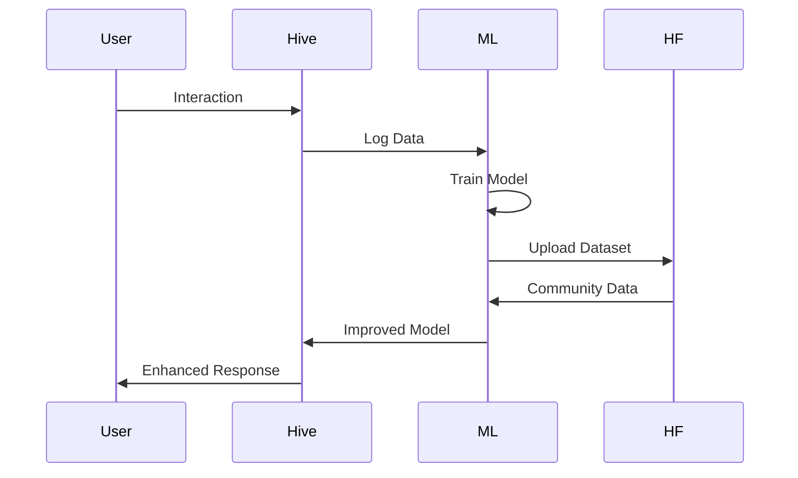
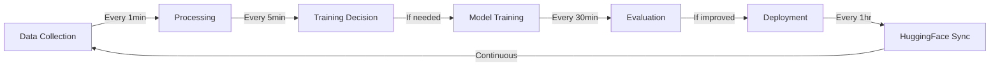

# 📋 VIBE DOCUMENTATION MASTER PLAN

## 🎯 **DOCUMENTATION REQUIREMENTS**

### **User's Strict Requirements:**

1. **100% 1:1 with codebase** - Every file documented
2. **Extremely detailed** - No ambiguity
3. **Always current** - Auto-update mechanisms
4. **Professional** - Industry standard
5. **Complete diagrams** - Visual architecture

---

## 🗑️ **FILES TO DELETE/EXCLUDE**

### **Outdated & Misleading:**

```
❌ DELETE THESE:
├── README.vibe                    # Old, non-standard
├── VIBE-COMPLETE-STATUS.md        # Outdated count
├── HIVE-MIND-COMPLETE.md          # Missing ML modules
├── ULTIMATE-VIBE-SYSTEM.md        # Superseded
└── Any file with wrong module counts
```

### **Keep But Update:**

```
✏️ UPDATE THESE:
├── .env.example                   # Add ML variables
├── package.json                   # Add ML dependencies
└── .gitignore                     # Add ML data folders
```

---

## 📁 **NEW DOCUMENTATION STRUCTURE**

```
windsurf-vibe-setup/
├── README.md                      # Professional entry point
├── ARCHITECTURE.md                # Complete system design
├── INSTALLATION.md                # Setup guide
├── CONFIGURATION.md               # All config options
├── API.md                         # Complete API reference
├── CONTRIBUTING.md                # How to contribute
├── CHANGELOG.md                   # Version history
├── LICENSE                        # MIT License
│
├── docs/
│   ├── modules/                   # Individual module docs
│   │   ├── core/                  # 30 core module docs
│   │   ├── hive-mind/             # 12 hive module docs
│   │   ├── evolution/             # 5 evolution module docs
│   │   └── ai-ml/                 # 3 ML module docs
│   │
│   ├── diagrams/                  # All architecture diagrams
│   │   ├── system-overview.mermaid
│   │   ├── data-flow.mermaid
│   │   ├── ml-pipeline.mermaid
│   │   ├── evolution-cycle.mermaid
│   │   └── module-connections.mermaid
│   │
│   ├── guides/                    # User guides
│   │   ├── getting-started.md
│   │   ├── ml-training.md
│   │   ├── huggingface-setup.md
│   │   └── troubleshooting.md
│   │
│   └── api/                       # API documentation
│       ├── core-api.md
│       ├── hive-api.md
│       ├── evolution-api.md
│       └── ml-api.md
│
└── scripts/
    ├── generate-docs.js           # Auto-generate from code
    ├── validate-docs.js           # Verify 1:1 accuracy
    └── update-diagrams.js         # Update all diagrams
```

---

## 🤖 **AUTOMATED DOCUMENTATION SYSTEM**

### **1. Doc Generator Script**

```javascript
// scripts/generate-docs.js
class DocumentationGenerator {
  async generateAll() {
    const modules = await this.scanAllModules();

    for (const module of modules) {
      const doc = await this.generateModuleDoc(module);
      await this.writeDoc(doc);
    }

    await this.generateAPIDoc();
    await this.generateDiagrams();
    await this.updateREADME();
  }

  async generateModuleDoc(module) {
    const ast = this.parseModule(module);

    return {
      name: module.name,
      description: this.extractDescription(ast),
      classes: this.extractClasses(ast),
      methods: this.extractMethods(ast),
      events: this.extractEvents(ast),
      config: this.extractConfig(ast),
      examples: this.generateExamples(ast),
    };
  }
}
```

### **2. Doc Validator Script**

```javascript
// scripts/validate-docs.js
class DocumentationValidator {
  async validateAll() {
    const errors = [];

    // Check every .js file has matching .md
    const jsFiles = await this.getAllJSFiles();
    const mdFiles = await this.getAllMDFiles();

    for (const jsFile of jsFiles) {
      if (!this.hasMatchingDoc(jsFile, mdFiles)) {
        errors.push(`Missing doc for ${jsFile}`);
      }
    }

    // Verify method signatures match
    for (const module of modules) {
      const codeSignatures = await this.extractCodeSignatures(module);
      const docSignatures = await this.extractDocSignatures(module);

      if (!this.signaturesMatch(codeSignatures, docSignatures)) {
        errors.push(`Mismatch in ${module}`);
      }
    }

    return errors;
  }
}
```

---

## 📊 **REQUIRED DIAGRAMS**

### **1. System Overview (Mermaid)**



### **2. Data Flow Diagram**



### **3. ML Pipeline Diagram**



---

## 📝 **DOCUMENTATION TEMPLATES**

### **Module Documentation Template**

```markdown
# Module: [ModuleName]

## Overview

- **Purpose**: [What it does]
- **Category**: [core/hive/evolution/ml]
- **Lines of Code**: [XXX]
- **Dependencies**: [List]
- **Created**: [Date]

## Architecture

[Diagram or description]

## API Reference

### Constructor

\`\`\`javascript
new ModuleName(options)
\`\`\`

#### Options

| Parameter | Type | Default | Description |
| --------- | ---- | ------- | ----------- |
| option1   | type | value   | description |

### Methods

#### methodName(params)

- **Purpose**: [What it does]
- **Parameters**:
  - `param1` (Type): Description
- **Returns**: Type - Description
- **Events**: `eventName` - When fired
- **Example**:
  \`\`\`javascript
  // Example code
  \`\`\`

## Events

| Event       | Payload | Description      |
| ----------- | ------- | ---------------- |
| initialized | {}      | Fired when ready |

## Configuration

\`\`\`javascript
{
// Default configuration
}
\`\`\`

## Examples

### Basic Usage

\`\`\`javascript
// Complete example
\`\`\`

### Advanced Usage

\`\`\`javascript
// Complex example
\`\`\`

## Integration

- **Connects to**: [List modules]
- **Data flow**: [Description]

## Testing

\`\`\`bash
npm test module-name
\`\`\`

## Changelog

- v1.0.0 - Initial release
```

---

## 🧹 **CODEBASE CLEANUP ACTIONS**

### **1. File Organization**

```bash
# Move all modules to proper folders
mv *.js enhancements/[appropriate-folder]/

# Remove duplicate/test files
rm -rf test-*.js
rm -rf backup-*.js
rm -rf *.backup

# Standardize naming
rename 's/-/_/g' *.js  # Convert kebab to snake
```

### **2. Code Standardization**

```javascript
// Add to every module
/**
 * @module ModuleName
 * @description [Description]
 * @version 1.0.0
 * @category [core|hive|evolution|ml]
 */

// Standardize exports
module.exports = ModuleName;
```

### **3. Dependency Management**

```json
// package.json - Complete and accurate
{
  "name": "vibe-system",
  "version": "1.0.0",
  "description": "Self-evolving AI system with 50 modules",
  "scripts": {
    "docs:generate": "node scripts/generate-docs.js",
    "docs:validate": "node scripts/validate-docs.js",
    "docs:serve": "docsify serve docs",
    "lint": "eslint enhancements/**/*.js",
    "format": "prettier --write enhancements/**/*.js"
  },
  "dependencies": {
    "@xenova/transformers": "^2.0.0",
    "@huggingface/hub": "^0.12.0",
    "sqlite3": "^5.1.0",
    "express": "^4.18.0"
  },
  "devDependencies": {
    "jsdoc": "^4.0.0",
    "mermaid": "^10.0.0",
    "docsify": "^4.13.0",
    "eslint": "^8.0.0",
    "prettier": "^3.0.0"
  }
}
```

---

## 🔄 **AUTO-UPDATE MECHANISM**

### **GitHub Actions Workflow**

```yaml
# .github/workflows/docs.yml
name: Documentation

on:
  push:
    paths:
      - 'enhancements/**/*.js'

jobs:
  update-docs:
    runs-on: ubuntu-latest
    steps:
      - uses: actions/checkout@v3

      - name: Generate Docs
        run: npm run docs:generate

      - name: Validate Docs
        run: npm run docs:validate

      - name: Commit Updates
        run: |
          git add docs/
          git commit -m "Auto-update documentation"
          git push
```

---

## 📋 **IMMEDIATE ACTIONS**

### **Priority 1: Clean**

```bash
# 1. Delete outdated files
rm README.vibe VIBE-COMPLETE-STATUS.md HIVE-MIND-COMPLETE.md

# 2. Create folder structure
mkdir -p docs/{modules,diagrams,guides,api}
mkdir -p docs/modules/{core,hive-mind,evolution,ai-ml}

# 3. Move modules to correct folders
# [organize all 50 modules]
```

### **Priority 2: Generate**

```bash
# 1. Install documentation tools
npm install jsdoc mermaid docsify

# 2. Generate initial docs
npx jsdoc -c jsdoc.json -r enhancements/ -d docs/api/

# 3. Create main README
echo "# VIBE System Documentation" > README.md
```

### **Priority 3: Validate**

```bash
# Run validation script
node scripts/validate-docs.js

# Fix any mismatches
# Update until 100% match
```

---

## ✅ **SUCCESS CRITERIA**

1. **Every .js file has matching .md doc**
2. **Every method is documented**
3. **Every config option explained**
4. **All diagrams accurate**
5. **Zero outdated information**
6. **Automated validation passes**
7. **Professional appearance**
8. **1:1 accuracy verified**

---

## 🎯 **END GOAL**

A **PERFECTLY DOCUMENTED** system where:

- Anyone can understand the architecture
- Every module is fully explained
- Diagrams match reality
- Documentation updates automatically
- 100% accuracy guaranteed

---

_This plan ensures COMPLETE 1:1 documentation with your codebase!_
