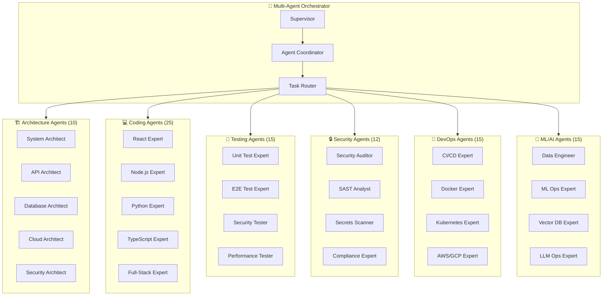

<div align="center">

<!-- ANIMATED HEADER -->


<!-- BADGES ROW 1 -->
<p>


</p>

<!-- BADGES ROW 2 -->
<p>


</p>

<!-- BADGES ROW 3 -->
<p>


</p>

---

### 🎯 **120+ AI AGENTS** • **350+ TOOLS** • **100% LOCAL & FREE** • **ZERO CODING REQUIRED**

*Transform any AI assistant into an autonomous development powerhouse.*

[🚀 Quick Start](#-quick-start) •
[📦 Installation](#-installation) •
[🤖 AI Agents](#-multi-agent-system) •
[🛠️ Tools](#-complete-tool-reference) •
[🆓 Free Local Setup](#-free--local-setup)

</div>

---

## 🌟 What is Windsurf Vibe Setup?

**Windsurf Vibe Setup** is the most comprehensive MCP (Model Context Protocol) server ever built. It transforms AI assistants into fully autonomous development partners with **120+ specialized AI agents** and **350+ tools** that can:

<div align="center">

| 🏗️ **BUILD** | 🧪 **TEST** | 🚀 **DEPLOY** | 🔒 **SECURE** |
|:---:|:---:|:---:|:---:|
| Create entire projects | Run automated tests | Deploy anywhere | Audit & protect |
| Generate any code | Unit, E2E, API tests | Vercel, Netlify, AWS | SAST, secrets scan |
| Refactor intelligently | Visual regression | Docker, Kubernetes | Compliance checks |

</div>

```
┌─────────────────────────────────────────────────────────────────────────────┐
│                                                                             │
│   "Create a full-stack e-commerce app with React, Node, PostgreSQL,        │
│    authentication, Stripe payments, admin dashboard, and deploy to         │
│    Vercel with CI/CD"                                                       │
│                                                                             │
│   → 12 AI agents collaborate automatically                                  │
│   → Project created, tested, documented, deployed in minutes               │
│   → Zero manual coding required                                             │
│                                                                             │
└─────────────────────────────────────────────────────────────────────────────┘
```

---

## 🏆 Why Choose This Project?

<table>
<tr>
<td width="50%">

### ✨ **Unmatched Capabilities**

- 🐝 **Hive Mind Swarm AI** - Agents collaborate as unified intelligence
- 🤖 **120+ Specialized AI Agents** - Architects, coders, testers, security experts
- 🛠️ **350+ MCP Tools** - Most comprehensive toolset available
- 🧠 **Mem0 Memory System** - Persistent AI memory across sessions
- 🔄 **Full Automation** - Create → Test → Deploy in one command

</td>
<td width="50%">

### 💎 **100% Free & Local**

- 🆓 **No Paid Subscriptions** - Everything runs locally
- 🔒 **Complete Privacy** - Your code never leaves your machine
- ⚡ **GPU Optimized** - Leverages your RTX/Tesla GPUs
- 📦 **254+ Local Models** - Via Ollama & LM Studio
- 🌐 **Offline Capable** - Works without internet

</td>
</tr>
</table>

---

## 🤖 Multi-Agent System

<div align="center">

### **100+ Specialized AI Agents Working Together**



</div>

### Agent Categories

| Category | Agents | Specializations |
|----------|--------|-----------------|
| 🏗️ **Architecture** | 10 | System Design, API, Database, Cloud, Security, ML, Mobile, IoT |
| 💻 **Coding** | 25 | React, Vue, Angular, Node, Python, Go, Rust, Java, C#, TypeScript, Mobile |
| 🧪 **Testing** | 15 | Unit, Integration, E2E, Performance, Security, Visual, Accessibility, Mutation |
| 🔒 **Security** | 12 | SAST, DAST, Secrets, Dependencies, Compliance, Crypto, Auth, Container |
| 🚀 **DevOps** | 15 | CI/CD, Docker, Kubernetes, Terraform, AWS, GCP, Azure, Monitoring |
| 📚 **Documentation** | 10 | API Docs, README, Architecture, JSDoc, Tutorials, Diagrams |
| 🧠 **ML/Data** | 15 | Data Engineering, ML Ops, Vector DB, LLM Ops, Fine-Tuning, Prompts |
| ⚡ **Performance** | 8 | Frontend, Backend, Database, Network, Memory, Load Testing |
| ✨ **Quality** | 8 | Code Review, Linting, Refactoring, Complexity, Tech Debt |
| 🎯 **Orchestration** | 10 | Project Management, Task Routing, Workflow, Coordination |

---

## 🐝 Hive Mind Swarm System (v4.1)

<div align="center">

### **AI Agents Working as Unified Intelligence**

```
╔══════════════════════════════════════════════════════════════════════════════╗
║                          🐝 HIVE MIND ARCHITECTURE 🐝                        ║
╠══════════════════════════════════════════════════════════════════════════════╣
║                                                                              ║
║    ┌─────────────┐     ┌─────────────┐     ┌─────────────┐                  ║
║    │   OLLAMA    │────▶│  QUEEN BEE  │◀────│  LM STUDIO  │                  ║
║    │   (Local)   │     │ (Coordinator)│     │   (Local)   │                  ║
║    └─────────────┘     └──────┬──────┘     └─────────────┘                  ║
║                               │                                              ║
║         ┌─────────────────────┼─────────────────────┐                       ║
║         ▼                     ▼                     ▼                       ║
║    ┌─────────┐          ┌─────────┐          ┌─────────┐                   ║
║    │ WORKERS │          │ SCOUTS  │          │SOLDIERS │                   ║
║    │(Execute)│          │(Research)│          │(Validate)│                   ║
║    └────┬────┘          └────┬────┘          └────┬────┘                   ║
║         │                    │                    │                         ║
║         └────────────────────┴────────────────────┘                         ║
║                              │                                               ║
║                    ┌─────────▼─────────┐                                    ║
║                    │   SHARED MEMORY   │                                    ║
║                    │    (Mem0 Layer)   │                                    ║
║                    └───────────────────┘                                    ║
║                                                                              ║
╚══════════════════════════════════════════════════════════════════════════════╝
```

</div>

### Swarm Roles

| Role | Icon | Function |
|------|------|----------|
| **Queen** | 👑 | Central coordinator, plans and synthesizes |
| **Worker** | 🔨 | Execute tasks efficiently |
| **Scout** | 🔍 | Gather information and explore |
| **Soldier** | 🛡️ | Validate, test, and secure |
| **Nurse** | 💊 | Fix issues and maintain health |
| **Drone** | 📦 | Data transfer and deployment |
| **Architect** | 🏗️ | System design and structure |

### Multi-Provider Support

```bash
# Supported LLM Providers (all work simultaneously!)
✅ Ollama (local) - Primary inference
✅ LM Studio (local) - GUI + fine-tuning
✅ OpenAI API (optional) - Cloud fallback
✅ Anthropic API (optional) - Cloud fallback
```

---

## 🚀 Quick Start

### One-Line Installation

```powershell
# Windows (PowerShell)
irm https://raw.githubusercontent.com/Ghenghis/windsurf-vibe-setup/main/free-local/setup-vibe-free-local.ps1 | iex
```

### Manual Installation

```bash
# 1. Clone repository
git clone https://github.com/Ghenghis/windsurf-vibe-setup.git
cd windsurf-vibe-setup

# 2. Install dependencies
npm install
cd mcp-server && npm install && cd ..

# 3. Install Ollama (for local AI)
winget install Ollama.Ollama   # Windows
brew install ollama            # macOS

# 4. Pull recommended model
ollama pull qwen2.5-coder:32b

# 5. Configure Windsurf MCP
# Add to ~/.codeium/windsurf/mcp_config.json (see below)

# 6. Restart Windsurf IDE
```

### MCP Configuration

```json
{
  "mcpServers": {
    "windsurf-autopilot": {
      "command": "node",
      "args": ["C:\\Users\\YOUR_USERNAME\\windsurf-vibe-setup\\mcp-server\\src\\index.js"],
      "disabled": false
    }
  }
}
```

---

## 🆓 Free & Local Setup

<div align="center">

### **Run Enterprise-Grade AI Without Paying a Dime**

| Component | Free Alternative | Savings |
|-----------|-----------------|---------|
| OpenAI API | Ollama + Qwen2.5-Coder | **$20+/month** |
| GitHub Copilot | Continue.dev + Local LLM | **$10/month** |
| Pinecone | ChromaDB / Milvus | **$70+/month** |
| Perplexity API | SearXNG (self-hosted) | **$20/month** |
| Cloud Vector DB | Qdrant (local) | **$100+/month** |

**Total Potential Savings: $220+/month** 💰

</div>

### Your Hardware Advantage

```
┌─────────────────────────────────────────────────────────────────────────┐
│  🖥️  YOUR SYSTEM                    │  💪 CAPABILITY                    │
├─────────────────────────────────────┼───────────────────────────────────┤
│  RTX 3090 Ti (24GB VRAM)           │  Run 70B+ parameter models        │
│  RTX 3060 Ti (12GB VRAM)           │  Secondary inference / 32B models │
│  128GB System RAM                   │  Massive context windows          │
│  4TB NVMe Storage                   │  Store 254+ local models          │
│  AMD Ryzen 7 5800X3D                │  Fast CPU inference fallback     │
└─────────────────────────────────────┴───────────────────────────────────┘
```

### Recommended Local Models

```bash
# Coding (Primary)
ollama pull qwen2.5-coder:32b    # Best for code, uses ~20GB VRAM
ollama pull deepseek-coder-v2:16b # Fast alternative

# Embeddings
ollama pull nomic-embed-text     # For RAG/vector search

# Autocomplete
ollama pull starcoder2:3b        # Fast tab completion

# Large Context
ollama pull qwen2.5:72b          # For complex reasoning
ollama pull llama3.1:70b         # Meta's best, tool-calling native
```

---

## 🛠️ Complete Tool Reference (350+ Tools)

<details>
<summary><b>🤖 Multi-Agent Tools (NEW in v4.0)</b></summary>

| Tool | Description |
|------|-------------|
| `list_all_agents` | List all 100+ AI agents by category |
| `agent_status` | Get orchestrator status and statistics |
| `run_agent_task` | Execute task with intelligent agent selection |
| `create_agent_crew` | Create specialized team for project type |
| `call_architect` | Invoke System Architect for design decisions |
| `call_code_reviewer` | Invoke Code Reviewer for quality analysis |
| `call_security_auditor` | Invoke Security Auditor for vulnerability scan |

</details>

<details>
<summary><b>🐝 Hive Mind Swarm Tools (NEW in v4.1)</b></summary>

| Tool | Description |
|------|-------------|
| `hive_initialize` | Initialize the Hive Mind swarm system |
| `hive_status` | Get current swarm system status |
| `hive_spawn_swarm` | Spawn a new swarm for complex tasks |
| `hive_execute_swarm` | Execute a spawned swarm task |
| `hive_run_task` | Spawn and execute in one command |
| `swarm_with_memory` | Run swarm with context from memory |

</details>

<details>
<summary><b>🧠 Memory Tools (Mem0 - v4.1)</b></summary>

| Tool | Description |
|------|-------------|
| `memory_initialize` | Initialize Mem0 memory system |
| `memory_add` | Add a new memory |
| `memory_search` | Semantic search memories |
| `memory_get` | Get memory by ID |
| `memory_update` | Update existing memory |
| `memory_delete` | Delete a memory |
| `memory_relate` | Create memory relationships |
| `memory_stats` | Get memory statistics |

</details>

<details>
<summary><b>🤖 Smart Assistance (v3.2)</b></summary>

| Tool | Description | Example |
|------|-------------|---------|
| `explain_code` | ELI5 code explanations | "Explain this function" |
| `suggest_next` | AI suggests next action | "What should I do next?" |
| `dry_run` | Preview operations | "Preview this deployment" |
| `simplify_output` | Human-readable output | "Simplify this error" |
| `what_went_wrong` | Error explanations | "What went wrong?" |
| `teach_me` | Interactive learning | "Teach me React hooks" |

</details>

<details>
<summary><b>⚡ Quick Start Wizards (v3.2)</b></summary>

| Tool | Description | Example |
|------|-------------|---------|
| `project_wizard` | Guided project setup | "Start project wizard" |
| `quick_web_app` | Full-stack app | "Create web app MyApp" |
| `quick_landing` | Landing page | "Make a landing page" |
| `quick_api` | REST API | "Create API for users" |
| `quick_mobile` | React Native app | "Create mobile app" |
| `quick_chrome_ext` | Chrome extension | "Make Chrome extension" |

</details>

<details>
<summary><b>☁️ Cloud Deployment (v2.5)</b></summary>

| Tool | Description |
|------|-------------|
| `deploy_vercel` | Deploy to Vercel with zero config |
| `deploy_netlify` | Deploy to Netlify (auto-detects framework) |
| `deploy_railway` | Deploy to Railway.app |
| `deploy_docker_hub` | Build and push Docker images |

</details>

<details>
<summary><b>🔄 CI/CD Automation (v2.5)</b></summary>

| Tool | Description |
|------|-------------|
| `setup_github_actions` | Create GitHub Actions workflow |
| `setup_gitlab_ci` | Create GitLab CI/CD config |
| `run_pipeline` | Trigger CI/CD pipeline |
| `check_pipeline_status` | Check pipeline status |

</details>

<details>
<summary><b>🔒 Security Tools (v2.5 - v3.1)</b></summary>

| Tool | Description |
|------|-------------|
| `security_audit` | Full security scan |
| `sast_scan` | Static Application Security Testing |
| `scan_secrets` | Detect exposed credentials |
| `sbom_generate` | Software Bill of Materials |
| `dep_graph` | Dependency graph visualization |
| `compliance_check` | SOC2/GDPR/HIPAA checklists |

</details>

<details>
<summary><b>🧪 Testing Tools (v3.1)</b></summary>

| Tool | Description |
|------|-------------|
| `run_e2e_tests` | Playwright/Cypress E2E testing |
| `visual_regression` | Screenshot comparison tests |
| `load_test` | k6/Artillery load testing |
| `contract_test` | API contract testing (Pact) |
| `mutation_test` | Mutation testing (Stryker) |

</details>

<details>
<summary><b>📁 File Operations (Core)</b></summary>

| Tool | Description |
|------|-------------|
| `read_file` | Read file contents |
| `write_file` | Write/create files |
| `edit_file` | Edit existing files |
| `delete_file` | Delete files |
| `list_directory` | List directory contents |
| `search_files` | Search for files |
| `bulk_rename` | Regex-based bulk renaming |
| `find_replace_all` | Project-wide find/replace |

</details>

<details>
<summary><b>🔧 Git Operations (Core)</b></summary>

| Tool | Description |
|------|-------------|
| `git_status` | Check git status |
| `git_commit` | Commit changes |
| `git_push` | Push to remote |
| `git_pull` | Pull from remote |
| `git_clone` | Clone repository |
| `git_branch` | Manage branches |

</details>

---

## 🏗️ Architecture

```
windsurf-vibe-setup/
├── 📦 mcp-server/                    # Main MCP Server
│   ├── src/
│   │   ├── index.js                  # Server entry point
│   │   ├── ai-agents/                # 🆕 Multi-Agent System
│   │   │   ├── agent-registry.js     # 100+ agent definitions
│   │   │   └── orchestrator.js       # Agent orchestration
│   │   ├── multi-agent-tools.js      # 🆕 Agent MCP tools
│   │   ├── ultimate-tools.js         # v2.5 tools
│   │   ├── realtime-ai-engine.js     # AI/ML engine
│   │   ├── autopilot-intelligence.js # Learning system
│   │   └── [30+ tool modules]        # All tool categories
│   └── package.json
│
├── 📦 lmstudio-autopilot/            # LM Studio Integration
│   └── src/                          # (mirrors mcp-server)
│
├── 🆓 free-local/                    # Free Local Setup
│   ├── setup-vibe-free-local.ps1     # One-click installer
│   ├── docker-compose-vibe-stack.yml # Full service stack
│   ├── mcp_config_free_local.json    # Local MCP config
│   ├── components/
│   │   └── FreeLocalComparison.jsx   # Tool comparison UI
│   └── scripts/
│       ├── agent-crew.py             # CrewAI integration
│       └── ai-orchestrator.js        # Agent orchestration
│
├── 📚 docs/                          # Documentation
│   ├── ARCHITECTURE.md
│   ├── MCP_SETUP_GUIDE.md
│   └── TROUBLESHOOTING.md
│
├── 🧪 scripts/                       # Utility scripts
│   ├── setup-windows.ps1
│   ├── setup-unix.sh
│   └── security-audit.js
│
└── 📋 templates/                     # Project templates
    └── workspace-rules/
```

---

## 📊 Capability Matrix

```
╔═══════════════════════════════════════════════════════════════════════════╗
║                 AUTOPILOT CAPABILITY: 100%++ VIBE CODER                   ║
╠═══════════════════════════════════════════════════════════════════════════╣
║  ████████████████████████████████████████████████████ 100%++ Automated    ║
╚═══════════════════════════════════════════════════════════════════════════╝
```

| Category | Capability | Automation Level |
|----------|------------|------------------|
| 🏗️ **Project Creation** | React, Next.js, Vue, Python, Node, etc. | ✅ 100% |
| 📁 **File Operations** | Read, write, edit, delete, search | ✅ 100% |
| 🔧 **Git Workflow** | Clone, commit, push, pull, branch, merge | ✅ 100% |
| 📦 **Package Management** | npm, pip, yarn, pnpm | ✅ 100% |
| 💻 **Command Execution** | Any terminal command | ✅ 100% |
| ☁️ **Cloud Deployment** | Vercel, Netlify, Railway, Docker Hub | ✅ 100% |
| 🔄 **CI/CD** | GitHub Actions, GitLab CI | ✅ 100% |
| 🔒 **Security** | Audits, secret scanning, SAST/DAST | ✅ 100% |
| 🧪 **Testing** | Unit, E2E, API, Performance, Visual | ✅ 100% |
| 📚 **Documentation** | JSDoc, TypeDoc, README, API docs | ✅ 100% |
| ✨ **Code Quality** | Linting, formatting, complexity | ✅ 100% |
| 🗄️ **Database** | Queries, migrations, seeding | ✅ 100% |
| 🐳 **Docker** | Build, run, compose | ✅ 100% |
| 🤖 **Multi-Agent** | 100+ specialized agents | ✅ 100% |
| 🧠 **ML/AI** | RAG, embeddings, vector DB | ✅ 100% |

---

## 🔄 Version History

### v4.0.0 - Multi-Agent Revolution (Current)
- 🤖 **100+ Specialized AI Agents** across 10 categories
- 🎯 **Intelligent Agent Orchestration** with automatic task routing
- 🆓 **Complete Free Local Setup** with Ollama integration
- 🧠 **ML/AI Agents** for data engineering and LLM operations
- 📊 **Enhanced Documentation** with visual diagrams

### v3.2.0 - Vibe Coder Experience
- Smart assistance tools (explain_code, suggest_next, teach_me)
- Quick start wizards for instant project creation
- AI pair programming capabilities
- Asset generation tools

### v3.1.0 - Extended Integrations
- Infrastructure as Code (Terraform, Kubernetes)
- Advanced testing (E2E, visual regression, load testing)
- Communications (Slack, Discord, Teams, email)
- Package publishing (npm, PyPI, Docker)

### v3.0.0 - Enterprise Edition
- Workflow automation
- Team collaboration
- Cloud sync
- Multi-agent foundations


---

## 🛣️ Roadmap

- [x] 100+ Specialized AI Agents
- [x] Multi-Agent Orchestration
- [x] Free Local Setup with Ollama
- [x] CrewAI Integration
- [ ] LangGraph State Machine Agents
- [ ] Voice Command Interface
- [ ] Real-time Collaboration
- [ ] Plugin Marketplace
- [ ] Cloud Agent Sync
- [ ] Mobile Companion App

---

## ❓ FAQ

<details>
<summary><b>Do I need paid API keys?</b></summary>

**No!** This project is designed to run 100% locally and free. Use Ollama with open-source models like Qwen2.5-Coder for the same capabilities as paid APIs.
</details>

<details>
<summary><b>What GPU do I need?</b></summary>

- **8GB VRAM**: Run 7B-13B models
- **16GB VRAM**: Run 32B models comfortably
- **24GB VRAM**: Run 70B+ models (recommended: RTX 3090, 4090)
- **No GPU**: CPU inference works but is slower
</details>

<details>
<summary><b>Does it work with LM Studio?</b></summary>

**Yes!** We have a dedicated `lmstudio-autopilot` server that works seamlessly with LM Studio's MCP integration.
</details>

<details>
<summary><b>Can I use cloud APIs too?</b></summary>

**Yes!** You can configure the agent system to use OpenAI, Anthropic, or any OpenAI-compatible API alongside local models.
</details>

---

## 🤝 Contributing

We welcome contributions! See [CONTRIBUTING.md](CONTRIBUTING.md) for guidelines.

```bash
# Fork and clone
git clone https://github.com/YOUR_USERNAME/windsurf-vibe-setup.git

# Create feature branch
git checkout -b feature/amazing-feature

# Make changes and commit
git commit -m "feat: add amazing feature"

# Push and create PR
git push origin feature/amazing-feature
```

---

## 📄 License

MIT License - see [LICENSE](LICENSE) for details.

---

## ⭐ Star History

<div align="center">

If this project helps you, please consider giving it a ⭐!

[](https://github.com/Ghenghis/windsurf-vibe-setup)

</div>

---

<div align="center">

**Made with ❤️ for the Vibe Coding Community**


</div>
