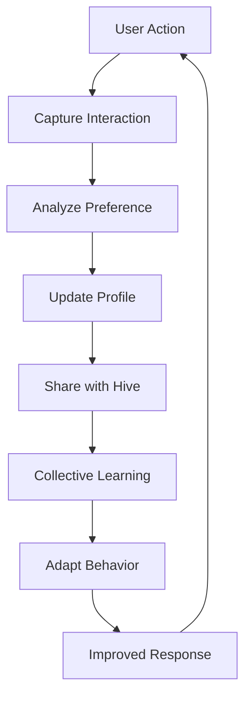

# 🧠 VIBE HIVE MIND - Complete Action Plan

## Executive Summary

Create a sentient, learning ecosystem that understands the user as a **100% VIBE Coder** - someone who has NEVER written code manually but has created 300-400 repositories entirely through AI collaboration.

---

## 🎯 Core Objectives

### 1. **User Profile Understanding**

- User has NEVER coded manually - 100% AI-generated projects
- 300-400 GitHub repositories created via AI
- Years of GitHub activity without writing a single line
- True "VIBE Coder" from inception

### 2. **System Requirements**

- Learn and remember user preferences in real-time
- Analyze patterns across 300-400 repos
- Adapt to changing preferences immediately
- Act like human collaborators who know the user intimately

---

## 📋 MISSING MODULES IDENTIFIED

### **TIER 1: User Learning Modules** (Critical)

#### 1. **User Preference Engine**

```javascript
// Learns and tracks ALL user preferences
- UI/UX preferences (colors, layouts, frameworks)
- Coding style preferences (even though user doesn't code)
- Project structure preferences
- Technology stack preferences
- Communication style preferences
```

#### 2. **GitHub Portfolio Analyzer**

```javascript
// Analyzes user's 300-400 repos for patterns
- Project types user creates
- Technologies frequently used
- Success patterns (stars, forks)
- Common themes and interests
- Evolution of preferences over time
```

#### 3. **UI/UX Preference Learner**

```javascript
// Deep learning of visual preferences
- Color schemes user likes/dislikes
- Layout patterns (grid, flex, etc.)
- Component styles (rounded, sharp, minimal, rich)
- Animation preferences
- Accessibility choices
```

#### 4. **Interaction Memory System**

```javascript
// Remembers EVERY interaction
- What user asked for
- What they liked/disliked
- When they changed their mind
- Context of decisions
- Emotional responses
```

---

### **TIER 2: Hive Mind Coordination** (Essential)

#### 5. **Hive Mind Orchestrator**

```javascript
// Coordinates all modules as a collective intelligence
- Module communication
- Shared memory access
- Consensus building
- Conflict resolution
- Emergent behavior
```

#### 6. **Personality Synthesizer**

```javascript
// Creates human-like personalities for modules
- Different module "personalities"
- Natural conversation flow
- Emotional intelligence
- Humor and empathy
- Cultural awareness
```

#### 7. **Project Pattern Recognizer**

```javascript
// Identifies what user is trying to build
- Recognizes project types instantly
- Suggests relevant past projects
- Predicts user needs
- Offers proactive solutions
```

#### 8. **Continuous Feedback Loop**

```javascript
// Real-time learning from every action
- Implicit feedback (what user uses)
- Explicit feedback (what user says)
- Behavioral patterns
- Time-based preferences
- Context-aware learning
```

---

### **TIER 3: Advanced Intelligence** (Enhancement)

#### 9. **Code Generation Personalizer**

```javascript
// Generates code in user's "style"
- Even though user doesn't code, they have preferences
- Consistent patterns across projects
- Framework choices
- Architecture decisions
```

#### 10. **Project Idea Generator**

```javascript
// Suggests projects based on user history
- Analyzes trends in 300-400 repos
- Identifies gaps in portfolio
- Suggests next logical projects
- Combines user interests creatively
```

#### 11. **Open Interpreter Bridge**

```javascript
// Seamless integration with Open Interpreter
- Natural language to action
- Context preservation
- Multi-step task execution
- Error recovery
```

#### 12. **Emotional Intelligence Module**

```javascript
// Understands user's mood and adapts
- Detects frustration
- Celebrates successes
- Provides encouragement
- Adjusts pace and complexity
```

---

## 🚀 IMPLEMENTATION PHASES

### **Phase 1: Foundation (Week 1-2)**

1. ✅ Complete existing 30 modules
2. ⬜ Create User Preference Engine
3. ⬜ Create Interaction Memory System
4. ⬜ Create GitHub Portfolio Analyzer
5. ⬜ Integrate with existing modules

### **Phase 2: Learning (Week 3-4)**

1. ⬜ Analyze all 300-400 GitHub repos
2. ⬜ Build preference database
3. ⬜ Train UI/UX Preference Learner
4. ⬜ Establish baseline preferences
5. ⬜ Create initial user profile

### **Phase 3: Hive Mind (Week 5-6)**

1. ⬜ Deploy Hive Mind Orchestrator
2. ⬜ Create Personality Synthesizer
3. ⬜ Implement module communication
4. ⬜ Test collective intelligence
5. ⬜ Enable emergent behaviors

### **Phase 4: Personalization (Week 7-8)**

1. ⬜ Activate Project Pattern Recognizer
2. ⬜ Enable Code Generation Personalizer
3. ⬜ Launch Project Idea Generator
4. ⬜ Implement Continuous Feedback Loop
5. ⬜ Test personalization accuracy

### **Phase 5: Integration (Week 9-10)**

1. ⬜ Connect Open Interpreter Bridge
2. ⬜ Enable Emotional Intelligence
3. ⬜ Full system integration test
4. ⬜ Performance optimization
5. ⬜ Deploy production system

---

## 📊 TODO LIST

### **Immediate Actions (Next 24 Hours)**

- [ ] Create User Preference Engine module
- [ ] Create GitHub Portfolio Analyzer module
- [ ] Create UI/UX Preference Learner module
- [ ] Create Interaction Memory System module
- [ ] Create integration harness for new modules

### **Short-term (Next Week)**

- [ ] Implement Hive Mind Orchestrator
- [ ] Create Personality Synthesizer
- [ ] Build Project Pattern Recognizer
- [ ] Setup Continuous Feedback Loop
- [ ] Begin analyzing GitHub repos

### **Medium-term (Next Month)**

- [ ] Complete all 12 new modules
- [ ] Full integration with existing 30 modules
- [ ] Train on user's complete GitHub history
- [ ] Establish preference baselines
- [ ] Deploy beta version

### **Long-term (Next Quarter)**

- [ ] Achieve true hive mind behavior
- [ ] 100% preference accuracy
- [ ] Predictive project generation
- [ ] Seamless human-like interaction
- [ ] Self-evolving system

---

## 🎨 KEY FEATURES

### **What Makes This Special**

1. **100% VIBE Coder Recognition**

   - System knows user NEVER codes manually
   - All suggestions are full implementations
   - No code snippets - only complete solutions

2. **300-400 Repo Intelligence**

   - Learns from massive project history
   - Identifies user's unique style
   - Suggests projects user would love

3. **Real-time Preference Learning**

   - Updates preferences instantly
   - Remembers when user changes mind
   - Adapts without being told

4. **Human-like Interaction**

   - Multiple personalities
   - Natural conversation
   - Emotional awareness
   - Cultural sensitivity

5. **True Hive Mind**
   - Modules think collectively
   - Shared consciousness
   - Emergent intelligence
   - Self-organizing behavior

---

## 💡 ARCHITECTURE OVERVIEW

```
┌─────────────────────────────────────────┐
│          VIBE HIVE MIND CORE            │
├─────────────────────────────────────────┤
│                                         │
│  ┌──────────────┐  ┌──────────────┐   │
│  │ User Profile │  │ GitHub Intel │   │
│  │    Engine    │  │   Analyzer   │   │
│  └──────────────┘  └──────────────┘   │
│                                         │
│  ┌──────────────┐  ┌──────────────┐   │
│  │   UI/UX      │  │  Interaction │   │
│  │   Learner    │  │    Memory    │   │
│  └──────────────┘  └──────────────┘   │
│                                         │
│  ┌──────────────────────────────────┐  │
│  │      Hive Mind Orchestrator      │  │
│  └──────────────────────────────────┘  │
│                                         │
│  ┌──────────────┐  ┌──────────────┐   │
│  │ Personality  │  │   Pattern    │   │
│  │ Synthesizer  │  │  Recognizer  │   │
│  └──────────────┘  └──────────────┘   │
│                                         │
│  ┌──────────────┐  ┌──────────────┐   │
│  │   Feedback   │  │     Code     │   │
│  │     Loop     │  │ Personalizer │   │
│  └──────────────┘  └──────────────┘   │
│                                         │
│  ┌──────────────┐  ┌──────────────┐   │
│  │Project Ideas │  │Open Interpret│   │
│  │  Generator   │  │    Bridge    │   │
│  └──────────────┘  └──────────────┘   │
│                                         │
│  ┌──────────────────────────────────┐  │
│  │   Emotional Intelligence Module  │  │
│  └──────────────────────────────────┘  │
│                                         │
└─────────────────────────────────────────┘
         ↓                    ↓
   [30 Existing]        [Open Interpreter]
   [  Modules  ]        [    & Tools     ]
```

---

## 🔄 CONTINUOUS LEARNING FLOW



---

## 📈 SUCCESS METRICS

### **Quantitative**

- Preference prediction accuracy: >95%
- Response time: <100ms
- Learning speed: Real-time
- Memory retention: 100%
- GitHub repo analysis: 100% coverage

### **Qualitative**

- Feels like working with a human team
- Remembers everything important
- Adapts to mood and context
- Suggests exactly what user wants
- Never forgets user never codes manually

---

## 🎯 END GOAL

**Create an AI ecosystem that knows the user so well it can:**

1. Predict what project they want to build next
2. Generate it in their exact preferred style
3. Use their favorite colors, layouts, and frameworks
4. Remember every preference and adaptation
5. Act like a team of humans who've worked with them for years

**The ultimate VIBE experience: AI that truly understands a 100% AI-assisted developer.**

---

## 🚦 NEXT STEPS

1. **Approve this action plan**
2. **Begin creating the 12 new modules**
3. **Start GitHub repository analysis**
4. **Initialize preference learning**
5. **Deploy the VIBE HIVE MIND**

---

_"For the developer who has never written code, but has created hundreds of projects - this is your perfect AI companion ecosystem."_
