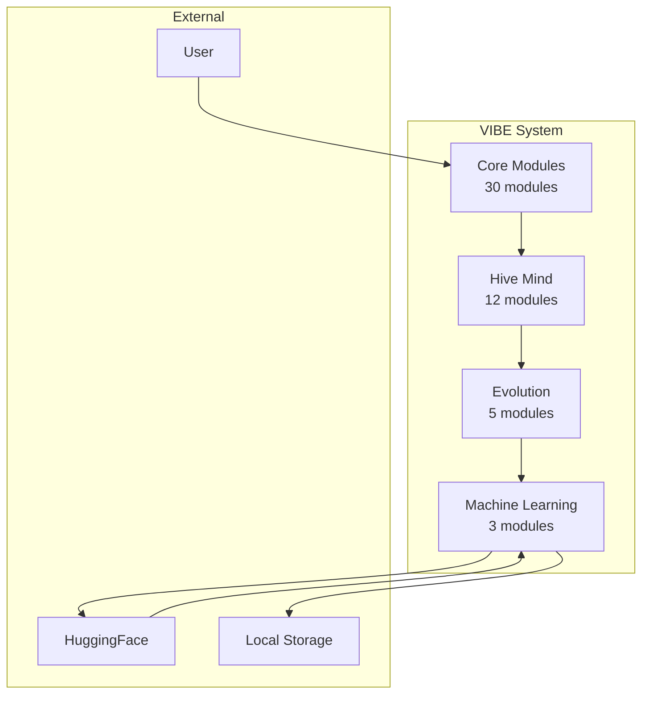
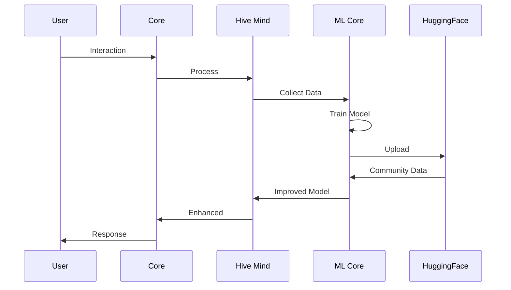
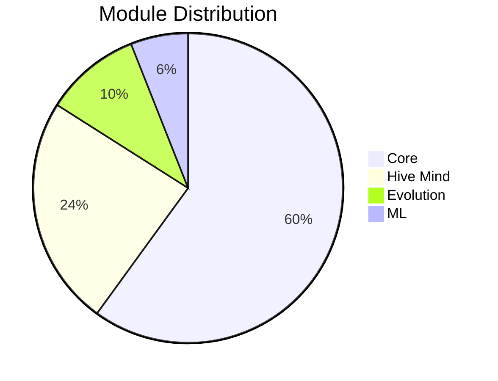

# System Architecture Diagrams

## System Overview

```mermaid
graph TB
    subgraph "VIBE System"
        Core[Core Modules<br/>30 modules]
        Hive[Hive Mind<br/>12 modules]
        Evolution[Evolution<br/>5 modules]
        ML[Machine Learning<br/>3 modules]
    end

    subgraph "External"
        HF[HuggingFace]
        Local[Local Storage]
        User[User]
    end

    User --> Core
    Core --> Hive
    Hive --> Evolution
    Evolution --> ML
    ML --> HF
    ML --> Local
    HF --> ML
```

## Data Flow

```mermaid
sequenceDiagram
    participant U as User
    participant C as Core
    participant H as Hive Mind
    participant M as ML Core
    participant HF as HuggingFace

    U->>C: Interaction
    C->>H: Process
    H->>M: Collect Data
    M->>M: Train Model
    M->>HF: Upload
    HF->>M: Community Data
    M->>H: Improved Model
    H->>C: Enhanced
    C->>U: Response
```

## Module Count by Category

```mermaid
pie title Module Distribution
    "Core" : 30
    "Hive Mind" : 12
    "Evolution" : 5
    "ML" : 3
```
